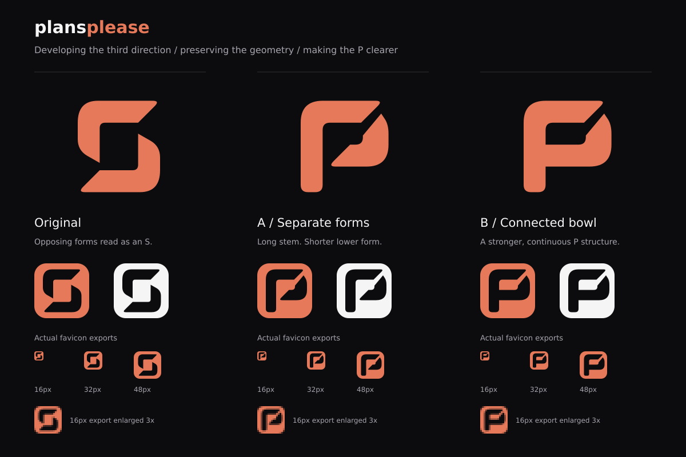

# plansplease icon studies

The brief is precise and approachable, with a distinctive silhouette. The
existing coral `#e5795a` and dark `#0c0c0e` palette stays. The mark must work in one
color and at 16 pixels without changing application styles.



The current proposal is **B, connected bowl**. A longer left stem extends below
the bowl, so the symbol reads as a P. The diagonal opening and rounded corners
retain the third study's geometry. This variation is used in the PR for review.

Variation A keeps the two forms separate, with a diagonal cut at the lower join.
Both variations have editable SVG sources and actual-size favicon exports. The
original Return symbol is included for comparison.

## Initial exploration

[The initial comparison](comparison.png) records the three earlier studies.

1. **Held.** A page joins a supporting stem to suggest a lowercase p. The
   angular head and rounded stem connect the product's purpose with its name.
   This study is retained as an earlier alternative.
2. **Fold.** A continuous stem and folded head form a simpler p. The open counter
   reads well at small sizes, with a more abstract connection to pages.
3. **Return.** Two offset forms hold an open space. This explores an abstract
   identity with fewer literal references to the product name.

Each symbol is an editable SVG. The comparison includes 16, 32 and 48 pixel PNG
exports embedded at their actual size, plus a nearest-neighbor enlargement of
each 16 pixel export. The white tiles demonstrate monochrome use, not a proposed
UI theme. Return P is used for the proposed application icon and social artwork.
No application styles change.

Initial exploration used the built-in image generation tool with the exact
[prompt](exploration-prompt.txt). These SVGs are separately drawn, flat-color
studies; the generated sheet is not a production asset.

To rerender the self-contained comparison SVG from the repository root:

```sh
node --input-type=module -e 'import sharp from "sharp"; await sharp("assets/brand/concepts/comparison.svg").png().toFile("assets/brand/concepts/comparison.png")'
node --input-type=module -e 'import sharp from "sharp"; await sharp("assets/brand/concepts/return-refinement.svg").png().toFile("assets/brand/concepts/return-refinement.png")'
```

Research informing the brief:

- [Apple's app icon guidance](https://developer.apple.com/design/human-interface-guidelines/app-icons/)
  recommends a simple concept, few shapes and consistency across platforms.
- [Google's optical sizing guidance](https://developers.google.com/fonts/docs/material_symbols)
  explains why stroke weight needs adjustment as icons change size.
- [MDN's favicon reference](https://developer.mozilla.org/en-US/docs/Glossary/Favicon)
  identifies 16 pixels as a common favicon size.
- [Slack's redesign account](https://slack.com/blog/news/say-hello-new-logo)
  describes the problems caused by inconsistent variants and color dependence.
- [Linear's brand guidelines](https://linear.app/brand)
  distinguish the roles of its name, symbol and icon, and emphasize clear space.
